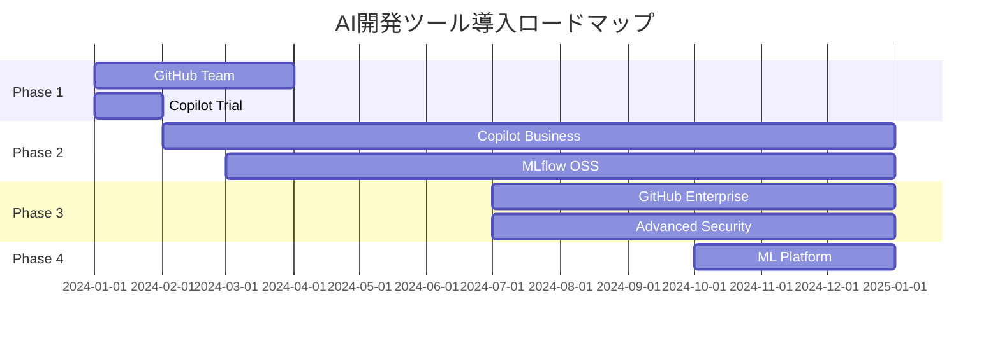

# 付録D：AIツールのコスト計算例

## GitHub Copilot コスト分析

### 個人開発者の場合

#### 前提条件
- 1日8時間、月20日稼働
- コーディング時間の60%でCopilotを使用
- Copilotにより生産性が30%向上

#### ROI計算
```
月間使用時間: 8時間 × 20日 × 60% = 96時間
生産性向上: 96時間 × 30% = 28.8時間相当

時給$50の開発者の場合:
節約額: 28.8時間 × $50 = $1,440
Copilot費用: $10/月
純利益: $1,430/月

投資回収期間: 即座
ROI: 14,300%
```

### チーム開発の場合（10人）

#### Copilot Business導入
```
初期設定:
- セットアップ時間: 2時間/人 × 10人 = 20時間
- トレーニング: 4時間

月間コスト:
- Copilot Business: $19 × 10人 = $190/月

効果測定（3ヶ月後）:
- コード生成速度: +40%
- バグ率: -15%
- コードレビュー時間: -25%

年間節約額:
- 開発時間: 10人 × 160時間 × 12ヶ月 × 35% = 6,720時間
- 金額換算: 6,720時間 × $50 = $336,000
- Copilot費用: $190 × 12 = $2,280
- 純利益: $333,720/年
```

## ML開発環境の総コスト

### スタートアップ（5人チーム）

#### 月間コスト内訳
```yaml
GitHub:
  Team Plan: $4 × 5 = $20
  Actions追加分: 5,000分 × $0.008 = $40
  Git LFS: $5 (50GB pack)
  小計: $65

AI開発ツール:
  Copilot Business: $19 × 5 = $95
  MLflow (self-hosted): $0
  Weights & Biases: $49/user × 5 = $245
  小計: $340

インフラ（AWS）:
  S3 (1TB): $23
  EC2 (ml.g4dn.xlarge, 100時間): $526
  SageMaker (実験用): $200
  小計: $749

合計: $1,154/月 ($231/人)
```

### 中規模企業（50人のAI部門）

#### 年間コスト計算
```yaml
GitHub Enterprise:
  ライセンス: $21 × 50 × 12 = $12,600
  Advanced Security: $49 × 30 × 12 = $17,640
  追加Actions: 50,000分 × $0.008 × 12 = $4,800
  年間計: $35,040

Copilot Enterprise:
  $39 × 50 × 12 = $23,400

データ・モデル管理:
  Git LFS Enterprise: $500/月 × 12 = $6,000
  DVC (Enterprise): $50 × 50 × 12 = $30,000
  MLflow (Enterprise): $100 × 50 × 12 = $60,000
  年間計: $96,000

クラウドインフラ（年間）:
  コンピュート: $150,000
  ストレージ: $30,000
  ネットワーク: $10,000
  年間計: $190,000

総計: $344,440/年 ($573/人/月)
```

## コスト最適化シミュレーション

### シナリオ1: オンプレミス vs クラウド

#### クラウドネイティブ
```python
# 月間コスト計算
def calculate_cloud_cost(gpu_hours, storage_tb, experiments):
    gpu_cost = gpu_hours * 3.06  # p3.2xlarge
    storage_cost = storage_tb * 23  # S3 standard
    experiment_cost = experiments * 50  # SageMaker jobs
    
    total = gpu_cost + storage_cost + experiment_cost
    return {
        'gpu': gpu_cost,
        'storage': storage_cost,
        'experiments': experiment_cost,
        'total': total
    }

# 使用例
monthly_usage = calculate_cloud_cost(
    gpu_hours=500,
    storage_tb=5,
    experiments=20
)
# 結果: {'gpu': 1530, 'storage': 115, 'experiments': 1000, 'total': 2645}
```

#### オンプレミス
```python
# 初期投資と月間コスト
def calculate_onprem_cost(servers=2, years=3):
    # 初期投資
    server_cost = servers * 15000  # DGX Station相当
    setup_cost = 5000
    initial = server_cost + setup_cost
    
    # 月間運用コスト
    electricity = servers * 200  # 電気代
    maintenance = initial * 0.10 / 12  # 年10%
    cooling = servers * 100
    monthly = electricity + maintenance + cooling
    
    # 3年間の総コスト
    total_cost = initial + (monthly * 12 * years)
    monthly_effective = total_cost / (12 * years)
    
    return {
        'initial': initial,
        'monthly_operating': monthly,
        'monthly_effective': monthly_effective,
        'breakeven_months': initial / (2645 - monthly)  # クラウドとの比較
    }

# 結果: 約18ヶ月で損益分岐点
```

### シナリオ2: Self-hosted Runner活用

#### GitHub Actions コスト削減
```yaml
# Before: GitHub-hosted runners
jobs:
  train:
    runs-on: ubuntu-latest  # $0.008/分
    steps:
      - name: Train model
        run: python train.py  # 120分
        
# コスト: 120分 × $0.008 × 30回/月 = $28.80/月

# After: Self-hosted runners  
jobs:
  train:
    runs-on: [self-hosted, gpu]  # $0/分
    steps:
      - name: Train model
        run: python train.py  # 30分（GPU使用）
        
# コスト: $0（電気代は別途）
# 時間短縮: 75%
```

## ROI改善戦略

### 1. 段階的導入プラン



### 2. 使用率最適化

```python
# 使用率モニタリング
class UsageOptimizer:
    def analyze_github_actions(self, workflow_runs):
        """Actions使用率を分析"""
        total_minutes = sum(run['duration'] for run in workflow_runs)
        billable_minutes = sum(
            run['duration'] * self.get_multiplier(run['os'])
            for run in workflow_runs
        )
        
        optimization = {
            'current_cost': billable_minutes * 0.008,
            'optimized_cost': self.calculate_optimized(workflow_runs),
            'savings': None
        }
        optimization['savings'] = (
            optimization['current_cost'] - optimization['optimized_cost']
        )
        
        return optimization
    
    def calculate_optimized(self, runs):
        """最適化後のコスト計算"""
        # Linux runnersへの移行
        # キャッシュの活用
        # 並列実行の最適化
        return sum(run['duration'] * 0.008 * 0.6 for run in runs)
```

### 3. ライセンス最適化

```python
# アクティブユーザー分析
def optimize_licenses(user_activity_log):
    """非アクティブユーザーを特定"""
    thirty_days_ago = datetime.now() - timedelta(days=30)
    
    inactive_users = []
    for user, last_activity in user_activity_log.items():
        if last_activity < thirty_days_ago:
            inactive_users.append(user)
    
    potential_savings = len(inactive_users) * 21  # Enterprise
    
    return {
        'inactive_users': inactive_users,
        'count': len(inactive_users),
        'potential_monthly_savings': potential_savings,
        'recommendation': 'Downgrade to Team or remove access'
    }
```

## 予算計画テンプレート

### 四半期予算計画
```python
def create_quarterly_budget(team_size, project_phase):
    """四半期予算を計算"""
    
    base_costs = {
        'github_enterprise': team_size * 21 * 3,
        'copilot_business': team_size * 19 * 3,
        'git_lfs': 50 * 3
    }
    
    phase_multipliers = {
        'research': {'compute': 0.5, 'storage': 0.3},
        'development': {'compute': 1.0, 'storage': 0.5},
        'production': {'compute': 1.5, 'storage': 1.0},
        'scaling': {'compute': 2.0, 'storage': 1.5}
    }
    
    compute_base = team_size * 500  # 基本コンピュート費用
    storage_base = team_size * 50   # 基本ストレージ費用
    
    phase_costs = {
        'compute': compute_base * phase_multipliers[project_phase]['compute'],
        'storage': storage_base * phase_multipliers[project_phase]['storage']
    }
    
    total_quarterly = (
        sum(base_costs.values()) + 
        sum(phase_costs.values()) * 3
    )
    
    return {
        'breakdown': {
            **base_costs,
            **{k: v*3 for k, v in phase_costs.items()}
        },
        'total_quarterly': total_quarterly,
        'monthly_average': total_quarterly / 3,
        'per_person': total_quarterly / 3 / team_size
    }
```

## コスト配分の推奨比率

### ML開発プロジェクトの理想的な配分

```python
def calculate_ideal_allocation(total_budget):
    """予算の理想的な配分を計算"""
    allocation = {
        'version_control': 0.05,      # GitHub等
        'ai_tools': 0.10,            # Copilot等
        'compute': 0.50,             # GPU/CPU
        'storage': 0.15,             # データ/モデル保存
        'monitoring': 0.10,          # MLOps/監視
        'security': 0.05,            # セキュリティツール
        'contingency': 0.05          # 予備費
    }
    
    return {
        category: total_budget * ratio
        for category, ratio in allocation.items()
    }

# 月間予算$10,000の場合
budget_allocation = calculate_ideal_allocation(10000)
# 結果:
# {
#   'version_control': 500,
#   'ai_tools': 1000,
#   'compute': 5000,
#   'storage': 1500,
#   'monitoring': 1000,
#   'security': 500,
#   'contingency': 500
# }
```

## まとめ

AI開発ツールのコスト最適化のポイント：

1. **段階的導入**: 小規模から始めて徐々に拡大
2. **使用率監視**: 実際の使用状況に基づいて最適化
3. **自動化投資**: 初期投資は高くても長期的に回収
4. **ハイブリッド戦略**: クラウドとオンプレミスの使い分け
5. **定期的な見直し**: 四半期ごとにコストと効果を評価

投資対効果を最大化するには、単にツールを導入するだけでなく、チームの習熟度向上と継続的な最適化が重要。