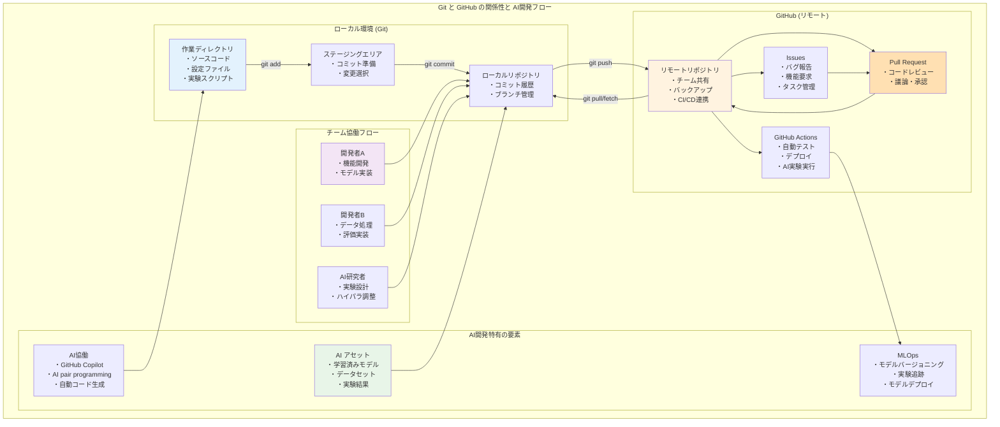

# 第1章：GitとGitHubの基本概念

## 1.1 バージョン管理の必要性

### AI開発におけるバージョン管理の重要性

AI開発では、以下の要素を管理する必要があります：
- ソースコード
- 設定ファイル（ハイパーパラメータ）
- 実験スクリプト
- データ前処理コード

これらの変更履歴を追跡しないと、以下の問題が発生します：

1. **再現性の欠如**: 「先週のモデルの方が精度が良かった」という状況で、元に戻せない
2. **チーム連携の困難**: 複数人が同時に編集すると、変更が上書きされる
3. **実験管理の混乱**: どのコードでどの結果が得られたか不明

### バージョン管理システムの基本機能

バージョン管理システムは以下を提供します：
- 変更履歴の記録
- 複数バージョンの並行管理
- 変更の取り消し・復元
- チームメンバー間での変更の共有

## 1.2 GitとGitHubの違い

### Git
- **定義**: 分散型バージョン管理システム
- **動作場所**: ローカルコンピュータ
- **主な機能**: ファイルの変更履歴管理

### GitHub
- **定義**: Gitリポジトリのホスティングサービス
- **動作場所**: クラウド（Web）
- **追加機能**: 
  - Pull Request
  - Issue管理
  - プロジェクト管理
  - CI/CD（GitHub Actions）
  - セキュリティスキャン

### 関係性



- Gitで管理したコードをGitHubに保存
- チームメンバーとGitHub経由で共有

## 1.3 リポジトリの概念

### リポジトリとは
プロジェクトのファイルと変更履歴を保存する場所です。

### リポジトリの種類

#### ローカルリポジトリ
- 自分のPC上に存在
- `.git`ディレクトリとして保存
- オフラインで作業可能

#### リモートリポジトリ
- GitHub上に存在
- チームで共有
- バックアップとしても機能

### AI開発でのリポジトリ構成例
```
my-ai-project/
├── .git/              # Gitの管理情報
├── src/               # ソースコード
├── models/            # 学習済みモデル
├── data/              # データセット（.gitignoreで除外、ファイルサイズが大きいため）
├── notebooks/         # Jupyter Notebook
├── configs/           # 設定ファイル
└── README.md          # プロジェクト説明
```

## 1.4 コミットとは何か

### コミットの定義
ある時点でのファイルの状態を記録したスナップショットです。

### コミットの要素
1. **一意のID（ハッシュ値）**: `a1b2c3d...`
2. **作成者情報**: 名前とメールアドレス
3. **タイムスタンプ**: 作成日時
4. **コミットメッセージ**: 変更内容の説明
5. **変更内容**: 追加・削除・修正されたファイル

### 良いコミットの原則
- 1つのコミットに1つの変更
- 明確なコミットメッセージ
- 動作する状態でコミット

### AI開発でのコミット例
```
feat: Add data augmentation for image classification
fix: Correct learning rate decay calculation
docs: Update model architecture diagram
experiment: Test different optimizer configurations
  - Results logged in experiments/2024-01-15-optimizer-test.json
  - Best accuracy: 94.2% with AdamW (lr=0.001)
```

実験系のコミットでは、結果ファイルへの参照や主要な指標を含めることで、後から実験を追跡しやすくなります。

## 1.5 ブランチの基本

### ブランチとは
コミットの履歴を枝分かれさせる機能です。

### ブランチの用途
1. **機能開発**: 新機能を独立して開発
2. **実験**: 異なるアプローチを並行して試行
3. **バグ修正**: メインコードに影響せず修正
4. **リリース管理**: 安定版と開発版の分離

### 基本的なブランチ
- `main`（または`master`）: メインブランチ
  - 注: 近年は包括性の観点から`main`が推奨されています
- `develop`: 開発用ブランチ
- `feature/*`: 機能開発用
- `experiment/*`: AI実験用

### AI開発でのブランチ戦略例

```mermaid
gitgraph
    commit id: "初期コミット"
    
    branch develop
    checkout develop
    commit id: "開発環境設定"
    commit id: "基本フレームワーク"
    
    branch feature/data-pipeline
    checkout feature/data-pipeline
    commit id: "データローダー実装"
    commit id: "前処理パイプライン"
    commit id: "バリデーション追加"
    
    checkout develop
    merge feature/data-pipeline
    commit id: "データパイプライン統合"
    
    branch feature/model-architecture
    checkout feature/model-architecture
    commit id: "ベースモデル実装"
    commit id: "カスタムレイヤー"
    commit id: "損失関数定義"
    
    checkout develop
    branch experiment/transformer-model
    checkout experiment/transformer-model
    commit id: "Transformer実装"
    commit id: "Attention機構"
    commit id: "実験結果記録"
    
    checkout develop
    merge feature/model-architecture
    commit id: "モデル統合"
    
    checkout main
    branch release/v1.0
    checkout release/v1.0
    commit id: "リリース準備"
    commit id: "ドキュメント更新"
    
    checkout main
    merge release/v1.0
    commit id: "v1.0リリース"
    
    checkout develop
    merge experiment/transformer-model
    commit id: "実験結果統合"
```



```mermaid
graph TD
    subgraph "AI開発ブランチ戦略の詳細"
        subgraph "メインブランチ"
            Main["main<br/>・本番用<br/>・安定版<br/>・リリースタグ"]
            Develop["develop<br/>・開発統合<br/>・テスト済み<br/>・次期リリース準備"]
        end
        
        subgraph "機能開発ブランチ"
            FeatureData["feature/data-pipeline<br/>・データ処理機能<br/>・ETLパイプライン<br/>・データバリデーション"]
            FeatureModel["feature/model-architecture<br/>・モデル実装<br/>・ネットワーク設計<br/>・レイヤー定義"]
            FeatureAPI["feature/api-endpoint<br/>・推論API<br/>・REST/GraphQL<br/>・認証機能"]
        end
        
        subgraph "実験ブランチ"
            ExpTransformer["experiment/transformer-model<br/>・新アーキテクチャ<br/>・ハイパーパラメータ<br/>・性能評価"]
            ExpOptimizer["experiment/new-optimizer<br/>・最適化手法<br/>・学習率調整<br/>・収束性検証"]
            ExpAugmentation["experiment/data-augmentation<br/>・データ拡張<br/>・水増し手法<br/>・精度向上"]
        end
        
        subgraph "リリースブランチ"
            Release["release/v1.0<br/>・リリース準備<br/>・バグ修正のみ<br/>・ドキュメント"]
        end
        
        subgraph "ホットフィックス"
            Hotfix["hotfix/security-patch<br/>・緊急修正<br/>・セキュリティ<br/>・クリティカルバグ"]
        end
        
        Main --> Release
        Release --> Main
        Develop --> Release
        
        FeatureData --> Develop
        FeatureModel --> Develop
        FeatureAPI --> Develop
        
        ExpTransformer -.-> Develop
        ExpOptimizer -.-> Develop
        ExpAugmentation -.-> Develop
        
        Main --> Hotfix
        Hotfix --> Main
        Hotfix --> Develop
    end
    
    style Main fill:#e8f5e8
    style Develop fill:#fff3e0
    style FeatureData fill:#e3f2fd
    style ExpTransformer fill:#f3e5f5
    style Release fill:#ffe0b2
    style Hotfix fill:#ffebee
```

## 1.6 ローカルとリモートの関係

### 基本的な流れ
1. **Clone**: リモートからローカルへコピー
2. **Pull**: リモートの更新をローカルへ取得
3. **Commit**: ローカルで変更を記録
4. **Push**: ローカルの変更をリモートへ送信

### 同期の仕組み


### リモートブランチの追跡
- ローカルブランチとリモートブランチの対応
- `origin/main`のような表記
- 追跡関係の設定

### AI開発での注意点
1. **大容量ファイル**: モデルファイルは別管理（Git LFS）
   - Git LFS (Large File Storage) は大容量ファイルを効率的に管理するGitの拡張機能
   - 詳細は付録Bで解説
2. **機密データ**: 学習データはリモートに送信しない
3. **実験結果**: 必要なものだけを選択してプッシュ

#### データ管理のベストプラクティス
- **データセット**: `.gitignore`で除外し、別途データ管理システム（DVC、S3等）を使用
- **モデルファイル**: Git LFSまたはモデルレジストリ（MLflow、Weights & Biases等）で管理
- **実験ログ**: 軽量なメタデータのみGitで管理、詳細ログは外部システムで管理

## まとめ

本章では、GitとGitHubの基本概念を学習しました：
- バージョン管理はAI開発の再現性確保に必須
- Gitはローカル、GitHubはリモートで動作
- リポジトリ、コミット、ブランチが基本要素
- ローカルとリモートの同期により協働作業が可能

次章では、これらの概念を実際のコマンドで操作する方法を学習します。

## 確認事項

- [ ] GitとGitHubの違いを説明できる
- [ ] リポジトリの概念を理解している
- [ ] コミットが何を記録するか理解している
- [ ] ブランチの用途を説明できる
- [ ] ローカルとリモートの関係を理解している