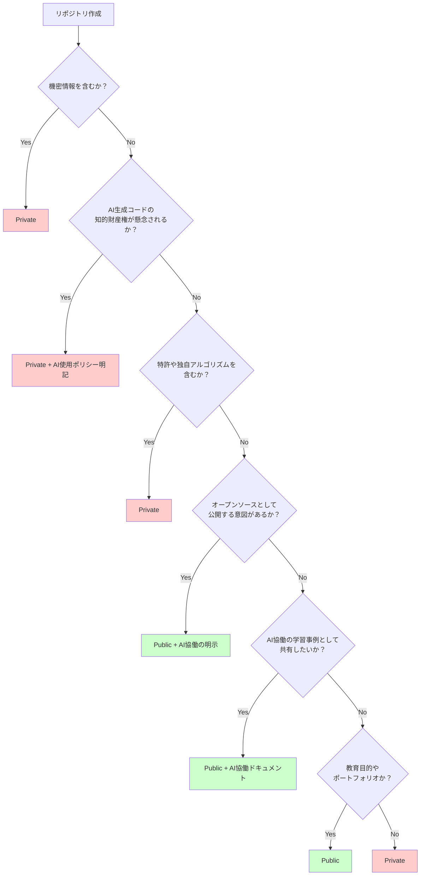

# 第5章：GitHubアカウントとリポジトリ管理

## 5.1 AI協働に最適化されたアカウント設定

### アカウント作成と初期設定

#### プロフィール設定
1. **基本情報**
   - ユーザー名（変更可能だが慎重に）
   - 表示名
   - Bio（自己紹介）
   - 所属組織
   - 場所
   - ウェブサイト

2. **AI協働型プロフィールREADME**
   `username/username`リポジトリの`README.md`をAI協働を明示
   ```markdown
   ### Hi there 👋
   
   I'm a Machine Learning Engineer specializing in AI-Collaborative Development.
   
   🤖 AI Collaboration: GitHub Copilot, ChatGPT, Claude
   🔭 Currently working on: AI-assisted image segmentation models
   🌱 Learning: Prompt engineering for code generation
   💬 Ask me about: PyTorch, MLOps, AI pair programming
   📫 How to reach me: [email/LinkedIn]
   
   #### Technologies & Tools
   
   
   
   
   #### AI Collaboration Metrics
   - 🚀 Development Speed: 2.3x faster with AI
   - 🎯 Code Quality: 15% fewer bugs with AI review
   - 📊 Productivity: 40% more features delivered
   ```

### セキュリティ設定

#### 二要素認証（2FA）の有効化
1. Settings → Password and authentication
2. Enable two-factor authentication
3. 認証アプリ（推奨）またはSMS

#### SSH鍵の管理
```bash
# 既存の鍵を確認
ls -la ~/.ssh

# 新しい鍵を生成（Ed25519推奨）
ssh-keygen -t ed25519 -C "your_email@example.com" -f ~/.ssh/github_ed25519

# 複数の鍵を使い分ける設定
~/.ssh/config:
Host github.com
    HostName github.com
    User git
    IdentityFile ~/.ssh/github_ed25519
    
Host github-work
    HostName github.com
    User git
    IdentityFile ~/.ssh/github_work_ed25519
```

#### Personal Access Token (PAT)
1. Settings → Developer settings → Personal access tokens
2. Tokens (classic) または Fine-grained tokens
3. スコープを最小限に設定

**Fine-grained tokensの例：**
- Repository access: 特定のリポジトリのみ
- Permissions:
  - Contents: Read
  - Pull requests: Write
  - Issues: Write
- Expiration: 90日

### 通知設定
Settings → Notifications で設定：
- **Participating**: メンション、アサイン時のみ
- **Watching**: すべてのアクティビティ
- **Custom**: リポジトリごとに設定

推奨設定：
```
✓ Participating
✓ @mentions
✓ Review requests
□ Push (noisy)
✓ Releases
```

## 5.2 AI協働を考慮したアカウント種別の選択

### AI協働機能を含む比較表

| 機能 | 個人アカウント | 組織アカウント |
|------|--------------|--------------|
| リポジトリ所有者 | 個人 | 組織 |
| アクセス管理 | コラボレーター単位 | チーム単位 |
| 権限の細分化 | 3段階 | 5段階+ |
| **Copilot管理** | 個人設定のみ | 組織ポリシー設定可能 |
| **AI使用制限** | 制御不可 | リポジトリ単位で制御 |
| **AI協働監査** | なし | Copilot使用ログあり |
| 監査ログ | なし | あり（有料） |
| SAML SSO | なし | あり（有料） |
| 必須レビュー | 基本機能 | AI生成コードの特別レビュー可能 |

### 組織アカウントの作成
1. 右上メニュー → New organization
2. プラン選択（Free/Team/Enterprise）
3. 組織名とメールアドレス
4. 既存リポジトリの移行（オプション）

### AI協働に最適化された組織設定
```yaml
# 基本設定
Organization name: ai-research-lab
Display name: AI Research Laboratory
Description: AI-Collaborative Machine Learning Research and Development
Email: contact@ai-research-lab.org
Location: Tokyo, Japan

# メンバー設定
Base permissions: Read
Repository creation: Members can create public repositories
Repository forking: Disabled
Pages creation: Members

# AI協働設定（Copilot Business/Enterprise）
Copilot:
  enabled: true
  suggestions_matching_public_code: blocked
  duplication_detection: maximum
  
# AI協働ポリシー
policies:
  - ai_code_review_required: true
  - ai_generation_tracking: enabled
  - ai_usage_reporting: weekly
```

## 5.3 AI協働を考慮したPublic/Privateリポジトリの選択基準

### AI協働を含む判断フローチャート



### Publicリポジトリの利点
- **コミュニティ貢献**: オープンソースエコシステムへの参加
- **ポートフォリオ**: スキルの証明
- **無料CI/CD**: GitHub Actionsの無料枠が大きい
- **コラボレーション**: 外部からの貢献を受けやすい

### Privateリポジトリの利点
- **機密性**: ソースコードの保護
- **開発中の保護**: 未完成のコードを非公開
- **ビジネス利用**: 商用プロジェクト
- **セキュリティ**: 脆弱性の非公開

### ハイブリッドアプローチ
```
my-ml-project/
├── my-ml-project-public/    # 公開可能な部分
│   ├── src/
│   ├── examples/
│   └── docs/
└── my-ml-project-private/   # 非公開部分
    ├── data/
    ├── credentials/
    └── proprietary/
```

## 4.4 リポジトリの基本設定

### General設定

#### リポジトリ名とDescription
```yaml
Repository name: image-classification-pytorch
Description: State-of-the-art image classification models implemented in PyTorch
Website: https://docs.example.com
Topics: machine-learning, pytorch, computer-vision, deep-learning
```

#### Features設定
- **Wikis**: ドキュメント管理
- **Issues**: 課題管理（推奨: ON）
- **Projects**: プロジェクト管理
- **Preserve this repository**: アーカイブ
- **Discussions**: コミュニティ議論

#### Pull Requests設定
- **Allow merge commits**: ✓
- **Allow squash merging**: ✓
- **Allow rebase merging**: ✓（チームの方針次第）
- **Automatically delete head branches**: ✓（推奨）

### ブランチ保護ルール

#### mainブランチの保護設定例
```yaml
Branch name pattern: main

Protect matching branches:
✓ Require a pull request before merging
  ✓ Require approvals: 1
  ✓ Dismiss stale pull request approvals
  ✓ Require review from CODEOWNERS
  
✓ Require status checks to pass
  ✓ Require branches to be up to date
  Status checks:
    - continuous-integration/travis-ci
    - codecov/patch
    
✓ Require conversation resolution

✓ Include administrators

✓ Restrict who can push to matching branches
  Users/teams: core-team
```

### Webhooksとインテグレーション

#### 一般的なWebhook
```json
{
  "name": "web",
  "active": true,
  "events": ["push", "pull_request", "issues"],
  "config": {
    "url": "https://api.example.com/webhooks/github",
    "content_type": "json",
    "secret": "webhook_secret_key"
  }
}
```

#### 有用なインテグレーション
- **Slack**: 通知連携
- **CircleCI/Travis CI**: CI/CD
- **Codecov**: カバレッジ
- **SonarCloud**: コード品質
- **Dependabot**: 依存関係更新

## 4.5 READMEとライセンスの設定

### 効果的なREADMEの構造

```markdown
# Project Name

[](https://travis-ci.org/username/repo)
[](LICENSE)
[](https://www.python.org/downloads/)

One-line description of your project.

## Features
- Feature 1
- Feature 2
- Feature 3

## Installation

### Requirements
- Python 3.8+
- PyTorch 1.9+
- CUDA 11.0+ (for GPU support)

### Setup
```bash
git clone https://github.com/username/repo.git
cd repo
pip install -r requirements.txt
```

## Quick Start
```python
from model import ImageClassifier

model = ImageClassifier()
predictions = model.predict(image)
```

## Documentation
Full documentation is available at [https://docs.example.com](https://docs.example.com)

## Examples
See the [examples/](examples/) directory for more examples.

## Contributing
Please read [CONTRIBUTING.md](CONTRIBUTING.md) for details on our code of conduct.

## License
This project is licensed under the MIT License - see the [LICENSE](LICENSE) file for details.

## Citation
If you use this software in your research, please cite:
```bibtex
@software{your_name_2024,
  author = {Your Name},
  title = {Project Name},
  year = {2024},
  url = {https://github.com/username/repo}
}
```

## Acknowledgments
- Acknowledgment 1
- Acknowledgment 2
```

### ライセンスの選択

#### AI/ML プロジェクトでの一般的なライセンス

1. **MIT License**
   - 最も制限が少ない
   - 商用利用可能
   - 著作権表示のみ必要

2. **Apache License 2.0**
   - 特許権の明確化
   - 商用利用可能
   - 変更の記録が必要

3. **GPL v3**
   - コピーレフト
   - 派生物も同じライセンス
   - 商用利用に制限

4. **カスタムライセンス**
   - 研究目的のみ
   - 非商用
   - モデルの重みとコードで異なるライセンス

### リポジトリテンプレート

#### テンプレートリポジトリの作成
Settings → Template repository にチェック

#### 標準構造
```
ml-project-template/
├── .github/
│   ├── workflows/
│   │   └── ci.yml
│   └── ISSUE_TEMPLATE/
├── src/
│   ├── __init__.py
│   ├── data/
│   ├── models/
│   ├── training/
│   └── utils/
├── tests/
├── notebooks/
├── configs/
├── requirements.txt
├── setup.py
├── README.md
├── LICENSE
├── CONTRIBUTING.md
└── .gitignore
```

### セキュリティポリシー

`SECURITY.md`:
```markdown
# Security Policy

## Supported Versions

| Version | Supported          |
| ------- | ------------------ |
| 1.x.x   | :white_check_mark: |
| < 1.0   | :x:                |

## Reporting a Vulnerability

Please report security vulnerabilities to security@example.com

Do NOT report security vulnerabilities through public GitHub issues.

## Response Timeline
- Initial response: within 48 hours
- Status update: within 1 week
- Resolution: depends on severity
```

## まとめ

本章では、GitHubアカウントとリポジトリ管理を学習しました：
- 個人アカウントのセキュリティ設定が基本
- 組織アカウントでチーム開発を効率化
- Public/Privateは目的に応じて選択
- リポジトリ設定で開発ワークフローを最適化
- READMEとライセンスでプロジェクトを明確化

次章では、GitHub Copilotの活用について学習します。

## 確認事項

- [ ] 二要素認証を有効化している
- [ ] SSH鍵を適切に管理している
- [ ] Public/Privateの選択基準を理解している
- [ ] ブランチ保護ルールを設定できる
- [ ] 適切なREADMEを作成できる