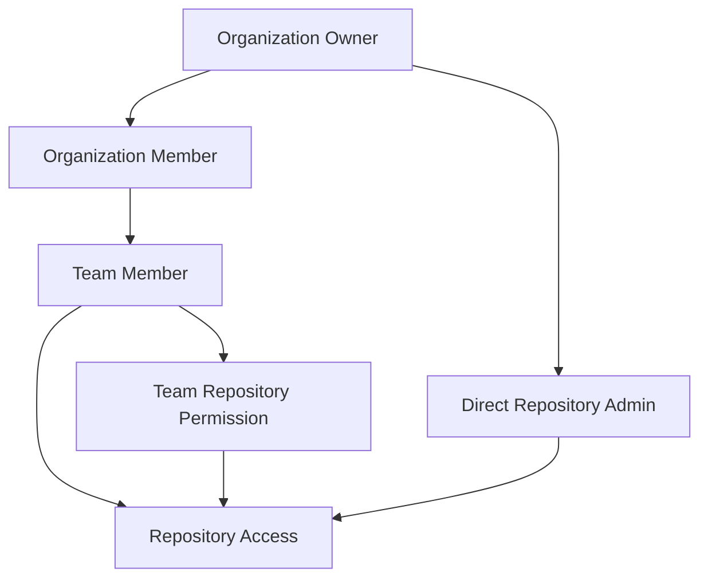

# 第9章：アクセス権限の体系

## 9.1 AI協働を考慮した権限設計

### AI協働時代の権限レベル

第2章で学んだAI協働パターンを踏まえ、権限設計にはAI生成コードの管理とレビューを考慮する必要があります。

**重要：カスタム権限について**

以下の例で示す`view_ai_collaboration_history`、`push_ai_generated_code`などの権限は、本書で提唱するAI協働ワークフローにおける**概念的な権限**です。これらは：

1. **GitHub標準機能の拡張概念**：GitHubの標準権限に加えて、AI協働に特化した管理要素を表現
2. **Enterprise向けカスタムロール**：GitHub Enterprise環境でのカスタムロール機能との連携を想定
3. **組織内ポリシー**：技術的制約ではなく、組織内でのガイドラインとして運用
4. **将来の機能拡張**：GitHubが今後提供する可能性のあるAI関連権限の先行モデル

実装時は、これらの概念を組織のポリシーやワークフロールールとして運用してください。

#### Read（読み取り）権限 + AI協働要素
```yaml
read_permissions:
  code:
    - view: true
    - clone: true
    - fork: true
    - download: true
    - view_ai_collaboration_history: true  # AI協働履歴の閲覧
  
  issues:
    - view: true
    - comment: true
    - create: false
    - view_ai_analysis: true  # AI分析結果の閲覧
    
  pull_requests:
    - view: true
    - comment: true
    - create: false
    - view_ai_review_comments: true  # AIレビューの閲覧
    
  wiki:
    - view: true
    - edit: false
    
  actions:
    - view_logs: true
    - trigger: false
    - view_ai_quality_gates: true  # AI品質ゲート結果の閲覧
    
  copilot:
    - personal_use: true  # 個人設定でのCopilot使用
    - org_settings_view: false
```

#### Write（書き込み）権限 + AI協働要素
```yaml
write_permissions:
  includes_all_read_permissions: true
  
  code:
    - push: true
    - create_branch: true
    - delete_branch: true  # protected除く
    - push_ai_generated_code: true  # AI生成コードのプッシュ
    - require_ai_disclosure: true   # AI使用の明示必須
    
  issues:
    - create: true
    - close: true
    - assign: true
    - label: true
    - create_with_ai_template: true  # 第2章のテンプレート使用
    
  ai_collaboration:
    - use_copilot: true
    - track_ai_usage: true
    - submit_ai_metrics: true
    
  pull_requests:
    - create: true
    - merge: true  # branch protectionに従う
    - close: true
    
  wiki:
    - edit: true
    - create_page: true
    
  actions:
    - trigger: true
    - cancel: true
```

#### Admin（管理者）権限
```yaml
admin_permissions:
  includes_all_write_permissions: true
  
  repository_settings:
    - change_visibility: true
    - delete_repository: true
    - transfer_ownership: true
    
  access_management:
    - invite_collaborators: true
    - manage_teams: true
    - change_permissions: true
    
  branch_protection:
    - create_rules: true
    - modify_rules: true
    - override_rules: true
    
  webhooks:
    - create: true
    - modify: true
    - delete: true
    
  secrets:
    - create: true
    - update: true
    - delete: true
```

### 権限の付与方法

#### 個人への直接付与
```bash
# GitHub CLIを使用
gh api repos/:owner/:repo/collaborators/:username \
  --method PUT \
  --field permission=write
```

#### プログラムによる管理
```python
# github_permissions.py
from github import Github

class PermissionManager:
    def __init__(self, token):
        self.github = Github(token)
    
    def grant_permission(self, repo_name, username, permission='read'):
        """
        権限を付与する
        permission: 'read', 'write', 'admin'
        """
        repo = self.github.get_repo(repo_name)
        
        # 既存の権限を確認
        try:
            current = repo.get_collaborator_permission(username)
            print(f"Current permission: {current}")
        except:
            print("User is not a collaborator")
        
        # 権限を設定
        repo.add_to_collaborators(username, permission=permission)
        print(f"Granted {permission} to {username}")
    
    def audit_permissions(self, repo_name):
        """リポジトリの権限を監査"""
        repo = self.github.get_repo(repo_name)
        
        permissions = {
            'admin': [],
            'write': [],
            'read': []
        }
        
        for collab in repo.get_collaborators():
            perm = repo.get_collaborator_permission(collab.login)
            permissions[perm].append(collab.login)
        
        return permissions
```

## 9.2 AI協働を考慮したブランチ保護ルール

### 基本的な保護設定

#### AI協働対応のmainブランチ保護
```yaml
# branch-protection-main-ai.yml
protection_rules:
  branch_name_pattern: "main"
  
  # PRが必須（AI協働要素を含む）
  require_pull_request_reviews:
    dismiss_stale_reviews: true
    require_code_owner_reviews: true
    required_approving_review_count: 2
    require_ai_disclosure: true  # AI使用の明示必須
    
  # ステータスチェック（第2章の品質ゲート含む）
  require_status_checks:
    strict: true  # ブランチが最新である必要
    contexts:
      - continuous-integration/travis-ci
      - security/code-scanning
      - coverage/coveralls
      - ai-collaboration-quality  # AI協働品質チェック
      - ai-security-scan         # AI生成コードセキュリティ
      
  # AI生成コードの追加チェック
  ai_code_checks:
    require_human_review: true
    track_ai_contribution: true
    maximum_ai_percentage: 80  # AI生成コード80%以下
      
  # 直接プッシュの制限
  restrict_push:
    users: []
    teams: ["release-managers"]
    
  # 強制プッシュの禁止
  allow_force_pushes: false
  
  # 削除の禁止
  allow_deletions: false
  
  # 管理者も規則に従う
  enforce_admins: true
```

### 環境別ブランチ保護

#### 開発・ステージング・本番
```python
# branch_protection_config.py
BRANCH_RULES = {
    'main': {
        'protection_level': 'strict',
        'required_reviews': 2,
        'dismiss_stale_reviews': True,
        'require_code_owner_reviews': True,
        'required_status_checks': [
            'test-suite',
            'security-scan',
            'build'
        ],
        'enforce_admins': True
    },
    
    'staging': {
        'protection_level': 'moderate',
        'required_reviews': 1,
        'dismiss_stale_reviews': True,
        'require_code_owner_reviews': False,
        'required_status_checks': [
            'test-suite',
            'build'
        ],
        'enforce_admins': False
    },
    
    'develop': {
        'protection_level': 'light',
        'required_reviews': 1,
        'dismiss_stale_reviews': False,
        'require_code_owner_reviews': False,
        'required_status_checks': [
            'test-suite'
        ],
        'enforce_admins': False
    },
    
    'feature/*': {
        'protection_level': 'none',
        'required_reviews': 0
    }
}
```

### 高度な保護ルール

#### 時間ベースの制限
```yaml
# 金曜日の午後はマージ禁止
deployment_restrictions:
  - type: time_based
    rules:
      - days: ["friday"]
        after: "15:00"
        timezone: "Asia/Tokyo"
        message: "No deployments after 3 PM on Fridays"
```

#### カスタムステータスチェック
```python
# custom_status_check.py
import requests
from datetime import datetime

class DeploymentGatekeeper:
    def check_deployment_window(self):
        now = datetime.now()
        
        # 営業時間外のチェック
        if now.hour < 9 or now.hour > 18:
            return {
                'state': 'failure',
                'description': 'Deployments only allowed during business hours',
                'context': 'deployment/time-window'
            }
            
        # 金曜午後のチェック
        if now.weekday() == 4 and now.hour >= 15:
            return {
                'state': 'failure',
                'description': 'No Friday afternoon deployments',
                'context': 'deployment/time-window'
            }
            
        return {
            'state': 'success',
            'description': 'Deployment window is open',
            'context': 'deployment/time-window'
        }
```

## 8.3 CODEOWNERSによる承認フロー

### CODEOWNERS ファイルの構造

#### 基本的な設定
`.github/CODEOWNERS`:
```bash
# グローバルオーナー（すべてのファイル）
* @tech-lead @senior-dev

# ドキュメント
/docs/ @doc-team
*.md @doc-team

# フロントエンド
/frontend/ @frontend-team
*.js @frontend-team
*.css @frontend-team

# バックエンド
/backend/ @backend-team
*.py @backend-team @ml-team

# MLモデル
/models/ @ml-team @senior-ml-engineer
/src/training/ @ml-team

# インフラ・DevOps
/.github/ @devops-team
/terraform/ @devops-team @security-team
/k8s/ @devops-team

# セキュリティが重要なファイル
/src/auth/ @security-team @backend-team
/src/crypto/ @security-team
*.key @security-team
*.pem @security-team

# データベース
/migrations/ @database-team @backend-team
/src/models/ @backend-team @database-team
```

### 階層的なオーナーシップ

#### 詳細度による優先順位
```bash
# CODEOWNERS - 階層的な例

# デフォルトオーナー
* @engineering-team

# プロジェクト別オーナー
/projects/image-classification/ @cv-team
/projects/nlp/ @nlp-team
/projects/recommendation/ @rec-team

# より詳細な設定が優先される
/projects/image-classification/models/ @cv-senior @cv-lead
/projects/image-classification/models/experimental/ @cv-research

# 特定ファイルの設定が最優先
/projects/image-classification/models/production/resnet50.py @cv-lead @ml-ops
```

### 動的なコードオーナー管理

#### チーム構成に基づく自動更新
```python
# update_codeowners.py
import yaml
from pathlib import Path

class CodeOwnersManager:
    def __init__(self, teams_config_path):
        with open(teams_config_path) as f:
            self.teams = yaml.safe_load(f)
    
    def generate_codeowners(self):
        lines = ["# Auto-generated CODEOWNERS file\n"]
        lines.append("# Last updated: " + datetime.now().isoformat() + "\n\n")
        
        # グローバルルール
        lines.append("# Global owners\n")
        lines.append(f"* @{self.teams['global']['tech_lead']}\n\n")
        
        # チーム別ルール
        for team_name, team_config in self.teams['teams'].items():
            lines.append(f"# {team_name.title()} Team\n")
            
            for path in team_config['paths']:
                owners = ' '.join([f"@{owner}" for owner in team_config['owners']])
                lines.append(f"{path} {owners}\n")
            
            lines.append("\n")
        
        # セキュリティルール
        lines.append("# Security-sensitive files\n")
        for pattern in self.teams['security']['patterns']:
            lines.append(f"{pattern} @{self.teams['security']['team']}\n")
        
        return ''.join(lines)
    
    def update_codeowners_file(self):
        content = self.generate_codeowners()
        
        with open('.github/CODEOWNERS', 'w') as f:
            f.write(content)
        
        # 変更をコミット
        import subprocess
        subprocess.run(['git', 'add', '.github/CODEOWNERS'])
        subprocess.run(['git', 'commit', '-m', 'chore: Update CODEOWNERS'])
```

## 8.4 Required reviewersの設定

### レビュアーの自動割り当て

#### プルリクエストレビュアー設定
`.github/auto_assign.yml`:
```yaml
# レビュアーの自動割り当て設定
addReviewers: true
addAssignees: false

# レビュアー候補
reviewers:
  # デフォルトレビュアー
  - tech-lead
  - senior-dev-1
  - senior-dev-2
  
# チーム別レビュアー
groups:
  ml-reviewers:
    - ml-engineer-1
    - ml-engineer-2
    - ml-lead
    
  backend-reviewers:
    - backend-dev-1
    - backend-dev-2
    - backend-lead
    
  frontend-reviewers:
    - frontend-dev-1
    - frontend-dev-2

# レビュアー数
numberOfReviewers: 2

# ファイルパターンによる割り当て
filePatterns:
  "*.py":
    reviewers:
      - python-expert
    groups:
      - backend-reviewers
      
  "models/**":
    groups:
      - ml-reviewers
    numberOfReviewers: 3
    
  "*.js":
    groups:
      - frontend-reviewers
```

### 条件付きレビュー要求

#### 変更内容に基づくレビュアー
```yaml
# .github/review-rules.yml
rules:
  - name: "Large PR"
    condition:
      files_changed: "> 50"
      lines_changed: "> 500"
    require:
      reviewers: 3
      senior_review: true
      
  - name: "Database Migration"
    condition:
      files_match: "migrations/**"
    require:
      reviewers: ["@database-team", "@backend-lead"]
      all_must_approve: true
      
  - name: "Security Changes"
    condition:
      files_match: ["**/auth/**", "**/security/**", "*.key"]
    require:
      reviewers: ["@security-team"]
      security_scan: true
      
  - name: "Performance Critical"
    condition:
      files_match: ["**/core/**", "**/engine/**"]
    require:
      reviewers: ["@performance-team"]
      benchmark_results: true
```

### レビュープロセスの自動化

#### レビューボット
```python
# review_bot.py
from github import Github
import re

class ReviewBot:
    def __init__(self, token):
        self.github = Github(token)
        self.review_patterns = {
            'security': {
                'patterns': [
                    r'password\s*=',
                    r'api_key\s*=',
                    r'secret\s*='
                ],
                'reviewers': ['@security-team']
            },
            'performance': {
                'patterns': [
                    r'for .+ in .+:\s*for',  # Nested loops
                    r'\.objects\.all\(\)',    # Django ORM N+1
                ],
                'reviewers': ['@performance-team']
            }
        }
    
    def analyze_pr(self, repo_name, pr_number):
        repo = self.github.get_repo(repo_name)
        pr = repo.get_pull(pr_number)
        
        required_reviewers = set()
        comments = []
        
        # 変更されたファイルを分析
        for file in pr.get_files():
            content = self.get_file_content(file)
            
            for category, config in self.review_patterns.items():
                for pattern in config['patterns']:
                    if re.search(pattern, content):
                        required_reviewers.update(config['reviewers'])
                        comments.append(
                            f"Pattern detected in {file.filename}: "
                            f"{category} review required"
                        )
        
        return {
            'reviewers': list(required_reviewers),
            'comments': comments
        }
```

## 8.5 権限の継承と上書き

### 組織からリポジトリへの権限継承

#### 継承の仕組み


### 権限の優先順位

#### 権限解決アルゴリズム
```python
class PermissionResolver:
    def __init__(self):
        self.permission_levels = {
            'none': 0,
            'read': 1,
            'triage': 2,
            'write': 3,
            'maintain': 4,
            'admin': 5
        }
    
    def resolve_permission(self, user, repo):
        """ユーザーの最終的な権限を解決"""
        permissions = []
        
        # 1. 直接付与された権限
        direct_permission = self.get_direct_permission(user, repo)
        if direct_permission:
            permissions.append(direct_permission)
        
        # 2. チーム経由の権限
        for team in user.teams:
            team_permission = self.get_team_permission(team, repo)
            if team_permission:
                permissions.append(team_permission)
        
        # 3. 組織のベース権限
        org_permission = self.get_org_base_permission(user, repo.org)
        if org_permission:
            permissions.append(org_permission)
        
        # 最も高い権限を返す
        if not permissions:
            return 'none'
            
        return max(permissions, 
                  key=lambda p: self.permission_levels[p])
    
    def get_effective_permissions(self, user, repo):
        """実効権限の詳細を取得"""
        permission = self.resolve_permission(user, repo)
        
        return {
            'level': permission,
            'source': self.get_permission_source(user, repo),
            'capabilities': self.get_capabilities(permission),
            'restrictions': self.get_restrictions(user, repo)
        }
```

### カスタム権限ロール

#### 組織固有のロール定義
```yaml
# custom-roles.yml
roles:
  ml_engineer:
    base_permission: write
    additional_permissions:
      - create_model_releases
      - access_training_data
      - modify_experiment_configs
    restrictions:
      - cannot_delete_models
      - cannot_modify_production_code
      
  data_scientist:
    base_permission: read
    additional_permissions:
      - create_notebooks
      - read_all_data
      - create_experiments
    restrictions:
      - cannot_merge_to_main
      - cannot_access_credentials
      
  ml_ops:
    base_permission: admin
    additional_permissions:
      - deploy_models
      - manage_infrastructure
      - access_all_secrets
    restrictions:
      - require_approval_for_deletions
```

### 権限の監査とコンプライアンス

#### 定期的な権限レビュー
```python
# permission_audit.py
class PermissionAuditor:
    def __init__(self, org_name):
        self.org_name = org_name
        self.audit_log = []
    
    def audit_all_repos(self):
        """全リポジトリの権限を監査"""
        org = self.github.get_organization(self.org_name)
        
        for repo in org.get_repos():
            self.audit_repo(repo)
    
    def audit_repo(self, repo):
        """個別リポジトリの監査"""
        issues = []
        
        # 管理者が多すぎないか
        admins = self.get_admins(repo)
        if len(admins) > 3:
            issues.append({
                'type': 'excessive_admins',
                'repo': repo.name,
                'count': len(admins),
                'users': admins
            })
        
        # 非アクティブユーザーの確認
        for collab in repo.get_collaborators():
            last_active = self.get_last_activity(collab, repo)
            if last_active > 90:  # 90日以上非アクティブ
                issues.append({
                    'type': 'inactive_user',
                    'repo': repo.name,
                    'user': collab.login,
                    'days_inactive': last_active
                })
        
        # 外部コラボレーターの確認
        external = self.get_external_collaborators(repo)
        for user in external:
            issues.append({
                'type': 'external_collaborator',
                'repo': repo.name,
                'user': user,
                'permission': self.get_permission(user, repo)
            })
        
        return issues
    
    def generate_report(self):
        """監査レポートの生成"""
        report = {
            'timestamp': datetime.now().isoformat(),
            'organization': self.org_name,
            'summary': {
                'total_repos': len(self.audit_log),
                'issues_found': sum(len(r['issues']) for r in self.audit_log),
                'critical_issues': self.count_critical_issues()
            },
            'details': self.audit_log
        }
        
        return report
```

## まとめ

本章では、GitHubのアクセス権限体系について学習しました：
- Read/Write/Adminの3段階の基本権限
- ブランチ保護で重要なコードを保護
- CODEOWNERSで責任範囲を明確化
- Required reviewersで品質を担保
- 権限の継承と優先順位を理解

次章では、組織管理とチーム運用について学習します。

## 確認事項

- [ ] リポジトリの権限レベルを理解している
- [ ] ブランチ保護ルールを設定できる
- [ ] CODEOWNERSファイルを作成できる
- [ ] レビュアーの自動割り当てを設定できる
- [ ] 権限の監査プロセスを実施できる