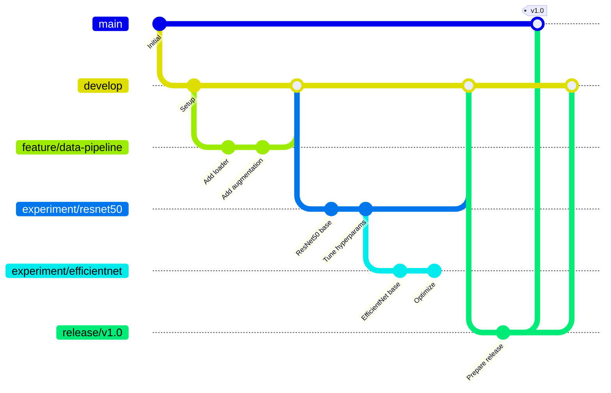

# 第12章：実践的なワークフロー設計

## 12.1 ケーススタディ：AI協働型モデル開発プロジェクト

本章では、第2章で学んだAI協働パターンを大規模なチーム開発に適用した実例を紹介します。

### プロジェクト概要

#### AI協働型画像分類モデル開発プロジェクト
```yaml
project:
  name: "AI-Collaborative ImageNet Classification Model"
  description: "Production-grade image classification system with AI collaboration"
  
  # 第2章のAI協働パターンを各チームで活用
  teams:
    - ml_research: 
        role: "Model architecture development"
        ai_collaboration: "CLEAR方式による設計提案、論文調査支援"
    - ml_engineering: 
        role: "Training pipeline and optimization"
        ai_collaboration: "コード生成、性能チューニング支援"
    - data_engineering: 
        role: "Dataset preparation and augmentation"
        ai_collaboration: "データ処理パイプライン生成、品質チェック"
    - mlops: 
        role: "Deployment and monitoring"
        ai_collaboration: "CI/CDパイプライン生成、監視コード作成"
  
  # 第2章のテンプレートを標準化
  collaboration_standards:
    issue_template: "第2章のAI最適化Issueテンプレートを使用"
    pr_template: "AI協働履歴を含むPRテンプレートを使用"
    review_process: "AI協働メトリクスによる品質測定"
    
  phases:
    1_research:
      duration: "2 weeks"
      deliverables:
        - "Model architecture design"
        - "Baseline experiments"
        
    2_development:
      duration: "4 weeks"
      deliverables:
        - "Training pipeline"
        - "Hyperparameter tuning"
        - "Model optimization"
        
    3_productionization:
      duration: "2 weeks"
      deliverables:
        - "Model serving API"
        - "Monitoring dashboard"
        - "Performance benchmarks"
```

### リポジトリ構造

#### モノレポ vs マルチレポ
```
# モノレポ構造（推奨）
image-classification/
├── .github/
│   ├── workflows/
│   │   ├── train.yml
│   │   ├── evaluate.yml
│   │   └── deploy.yml
│   └── CODEOWNERS
├── data/
│   ├── raw/              # Git LFSまたは外部ストレージ
│   ├── processed/
│   └── scripts/
├── models/
│   ├── architectures/
│   ├── checkpoints/      # Git LFSまたは外部ストレージ
│   └── configs/
├── src/
│   ├── data_loading/
│   ├── training/
│   ├── evaluation/
│   └── serving/
├── experiments/
│   ├── baseline/
│   ├── architecture_search/
│   └── hyperparameter_tuning/
├── notebooks/
│   ├── exploration/
│   └── visualization/
├── tests/
├── docs/
├── requirements/
│   ├── base.txt
│   ├── dev.txt
│   └── prod.txt
└── README.md
```

### ブランチ戦略

#### ML開発向けGit Flow


### 実装例

#### プロジェクト初期設定スクリプト
```python
# scripts/setup_project.py
import os
import subprocess
from pathlib import Path

class ProjectSetup:
    def __init__(self, project_name, github_org):
        self.project_name = project_name
        self.github_org = github_org
        self.repo_name = f"{github_org}/{project_name}"
    
    def create_repository(self):
        """GitHubリポジトリを作成"""
        subprocess.run([
            'gh', 'repo', 'create', 
            self.repo_name,
            '--private',
            '--description', 'Image classification model development',
            '--clone'
        ])
    
    def setup_branch_protection(self):
        """ブランチ保護ルールを設定"""
        rules = {
            'main': {
                'required_reviews': 2,
                'dismiss_stale_reviews': True,
                'require_code_owner_reviews': True,
                'required_status_checks': [
                    'test-suite',
                    'security-scan',
                    'model-validation'
                ]
            },
            'develop': {
                'required_reviews': 1,
                'required_status_checks': ['test-suite']
            }
        }
        
        for branch, config in rules.items():
            self._create_branch_protection(branch, config)
    
    def setup_labels(self):
        """Issue/PRラベルを設定"""
        labels = [
            # タイプ
            ('type:bug', 'd73a4a', 'Something isn\'t working'),
            ('type:feature', '0075ca', 'New feature or request'),
            ('type:experiment', '7057ff', 'ML experiment'),
            
            # 優先度
            ('priority:high', 'e11d21', 'High priority'),
            ('priority:medium', 'fbca04', 'Medium priority'),
            ('priority:low', '0e8a16', 'Low priority'),
            
            # コンポーネント
            ('component:data', '1d76db', 'Data pipeline'),
            ('component:model', '5319e7', 'Model architecture'),
            ('component:training', 'b60205', 'Training pipeline'),
            ('component:serving', 'ee0701', 'Model serving'),
            
            # ステータス
            ('status:in-progress', 'ededed', 'Work in progress'),
            ('status:blocked', 'd93f0b', 'Blocked by dependencies'),
            ('status:review-needed', '006b75', 'Needs review')
        ]
        
        for name, color, description in labels:
            subprocess.run([
                'gh', 'label', 'create',
                name,
                '--color', color,
                '--description', description,
                '--repo', self.repo_name
            ])
    
    def create_issue_templates(self):
        """Issueテンプレートを作成"""
        templates_dir = Path('.github/ISSUE_TEMPLATE')
        templates_dir.mkdir(parents=True, exist_ok=True)
        
        # 実験提案テンプレート
        experiment_template = """---
name: Experiment Proposal
about: Propose a new ML experiment
title: '[EXPERIMENT] '
labels: 'type:experiment'
assignees: ''
---

## Hypothesis
<!-- What do you want to validate? -->

## Proposed Approach
<!-- Describe the experiment setup -->

### Model Architecture
<!-- Describe the model architecture -->

### Training Configuration
- Dataset:
- Batch size:
- Learning rate:
- Epochs:
- Other hyperparameters:

## Success Metrics
<!-- How will you measure success? -->
- Primary metric:
- Secondary metrics:

## Resource Requirements
- GPU hours:
- Storage:
- Timeline:

## Risks and Mitigation
<!-- What could go wrong and how to handle it? -->
"""
        
        (templates_dir / 'experiment_proposal.md').write_text(experiment_template)
```

## 11.1.2 Issue駆動開発の実践

### Issue管理のベストプラクティス

#### Issueの種類と使い分け
```python
# issue_manager.py
from github import Github
from datetime import datetime, timedelta

class IssueManager:
    def __init__(self, repo):
        self.repo = repo
        self.issue_types = {
            'experiment': {
                'label': 'type:experiment',
                'template': 'experiment_proposal.md',
                'auto_assign': ['ml-research-team']
            },
            'bug': {
                'label': 'type:bug',
                'template': 'bug_report.md',
                'auto_assign': ['ml-engineering-team']
            },
            'feature': {
                'label': 'type:feature',
                'template': 'feature_request.md',
                'auto_assign': ['product-team']
            },
            'data': {
                'label': 'component:data',
                'template': 'data_issue.md',
                'auto_assign': ['data-team']
            }
        }
    
    def create_experiment_issue(self, hypothesis, approach, metrics):
        """実験用Issueを作成"""
        title = f"[EXPERIMENT] {hypothesis[:50]}..."
        
        body = f"""
## Hypothesis
{hypothesis}

## Approach
{approach}

## Success Metrics
{metrics}

## Tracking
- [ ] Baseline established
- [ ] Experiment implemented
- [ ] Results documented
- [ ] Decision made

## Results
<!-- To be filled after experiment -->

| Metric | Baseline | Experiment | Improvement |
|--------|----------|------------|-------------|
| Accuracy | - | - | - |
| F1 Score | - | - | - |
| Inference Time | - | - | - |
"""
        
        issue = self.repo.create_issue(
            title=title,
            body=body,
            labels=['type:experiment', 'status:planning']
        )
        
        # 実験用ブランチを自動作成
        branch_name = f"experiment/issue-{issue.number}"
        self.create_branch(branch_name)
        
        return issue
    
    def link_pr_to_issue(self, pr_number, issue_number):
        """PRとIssueを関連付け"""
        pr = self.repo.get_pull(pr_number)
        issue = self.repo.get_issue(issue_number)
        
        # PR本文を更新
        current_body = pr.body or ""
        updated_body = f"{current_body}\n\nCloses #{issue_number}"
        pr.edit(body=updated_body)
        
        # Issueにコメント
        issue.create_comment(
            f"Pull Request #{pr_number} has been created to address this issue."
        )
    
    def track_experiment_progress(self, issue_number, metrics):
        """実験の進捗を追跡"""
        issue = self.repo.get_issue(issue_number)
        
        # 結果テーブルを更新
        comment = f"""
## Experiment Update - {datetime.now().strftime('%Y-%m-%d')}

### Results
| Metric | Value | vs Baseline |
|--------|-------|-------------|
| Accuracy | {metrics['accuracy']:.4f} | {metrics['accuracy_diff']:+.4f} |
| F1 Score | {metrics['f1']:.4f} | {metrics['f1_diff']:+.4f} |
| Inference Time | {metrics['inference_ms']:.1f}ms | {metrics['time_diff']:+.1f}ms |

### Artifacts
- Model checkpoint: `experiments/issue-{issue_number}/model_best.pth`
- Training logs: `experiments/issue-{issue_number}/train.log`
- Evaluation report: `experiments/issue-{issue_number}/eval_report.md`
"""
        
        issue.create_comment(comment)
        
        # ラベルを更新
        issue.add_to_labels('status:results-available')
```

### スプリント管理

#### プロジェクトボードの活用
```python
# sprint_manager.py
class SprintManager:
    def __init__(self, repo, project_id):
        self.repo = repo
        self.project = self.get_project(project_id)
        
    def create_sprint(self, sprint_number, start_date, duration_days=14):
        """新しいスプリントを作成"""
        sprint_name = f"Sprint {sprint_number}"
        
        # マイルストーンを作成
        milestone = self.repo.create_milestone(
            title=sprint_name,
            due_on=start_date + timedelta(days=duration_days),
            description=f"Sprint {sprint_number} goals and deliverables"
        )
        
        # プロジェクトボードのカラムを準備
        columns = ['Backlog', 'To Do', 'In Progress', 'In Review', 'Done']
        
        return {
            'milestone': milestone,
            'start_date': start_date,
            'end_date': start_date + timedelta(days=duration_days),
            'columns': columns
        }
    
    def plan_sprint(self, sprint, issues):
        """スプリントの計画"""
        total_points = 0
        sprint_issues = []
        
        for issue in issues:
            # ストーリーポイントを取得（ラベルから）
            points = self.get_story_points(issue)
            
            if total_points + points <= self.team_velocity:
                # スプリントに追加
                issue.edit(milestone=sprint['milestone'])
                sprint_issues.append(issue)
                total_points += points
        
        return {
            'planned_issues': sprint_issues,
            'total_points': total_points,
            'capacity_usage': total_points / self.team_velocity
        }
    
    def generate_sprint_report(self, sprint):
        """スプリントレポートを生成"""
        milestone = sprint['milestone']
        
        # 完了したIssueを取得
        completed = list(self.repo.get_issues(
            milestone=milestone,
            state='closed'
        ))
        
        # 未完了のIssueを取得
        incomplete = list(self.repo.get_issues(
            milestone=milestone,
            state='open'
        ))
        
        report = f"""
# {milestone.title} Report

## Summary
- **Duration**: {sprint['start_date']} to {sprint['end_date']}
- **Completed**: {len(completed)} issues
- **Incomplete**: {len(incomplete)} issues
- **Completion Rate**: {len(completed) / (len(completed) + len(incomplete)) * 100:.1f}%

## Completed Items
{self._format_issues(completed)}

## Incomplete Items
{self._format_issues(incomplete)}

## Velocity Metrics
- **Planned**: {self._calculate_points(completed + incomplete)} points
- **Completed**: {self._calculate_points(completed)} points
- **Velocity**: {self._calculate_points(completed) / 14:.1f} points/day

## Key Achievements
{self._extract_achievements(completed)}

## Blockers and Challenges
{self._extract_blockers(incomplete)}
"""
        
        return report
```

## 11.1.3 Feature Branchワークフロー

### ブランチ命名規則

#### 構造化された命名
```python
# branch_manager.py
class BranchManager:
    def __init__(self, repo):
        self.repo = repo
        self.branch_patterns = {
            'feature': 'feature/{issue_number}-{description}',
            'experiment': 'experiment/{model}-{variant}',
            'bugfix': 'bugfix/{issue_number}-{description}',
            'hotfix': 'hotfix/{severity}-{description}',
            'release': 'release/v{version}',
            'data': 'data/{dataset}-{version}'
        }
    
    def create_feature_branch(self, issue_number, description):
        """Feature branchを作成"""
        # 説明をURL-safeに変換
        safe_description = self._sanitize_description(description)
        
        branch_name = self.branch_patterns['feature'].format(
            issue_number=issue_number,
            description=safe_description
        )
        
        # ブランチを作成
        base_branch = self.repo.get_branch('develop')
        self.repo.create_git_ref(
            ref=f'refs/heads/{branch_name}',
            sha=base_branch.commit.sha
        )
        
        # ブランチ保護ルール（オプション）
        if self._should_protect_branch(branch_name):
            self._add_branch_protection(branch_name)
        
        return branch_name
    
    def create_experiment_branch(self, model_name, variant):
        """実験用ブランチを作成"""
        branch_name = self.branch_patterns['experiment'].format(
            model=model_name.lower(),
            variant=variant.lower()
        )
        
        # メタデータを含むREADMEを作成
        readme_content = f"""
# Experiment: {model_name} - {variant}

## Configuration
- Base Model: {model_name}
- Variant: {variant}
- Created: {datetime.now().isoformat()}

## Hypothesis
[To be filled]

## Results
[To be updated after experiments]
"""
        
        # ブランチを作成してREADMEをコミット
        self._create_branch_with_file(
            branch_name,
            f'experiments/{model_name}_{variant}/README.md',
            readme_content
        )
        
        return branch_name
    
    def merge_strategy(self, source_branch, target_branch):
        """マージ戦略を決定"""
        strategies = {
            ('experiment/*', 'develop'): 'squash',
            ('feature/*', 'develop'): 'merge',
            ('develop', 'main'): 'merge',
            ('hotfix/*', 'main'): 'merge',
            ('release/*', 'main'): 'merge'
        }
        
        for (source_pattern, target_pattern), strategy in strategies.items():
            if self._matches_pattern(source_branch, source_pattern) and \
               self._matches_pattern(target_branch, target_pattern):
                return strategy
        
        return 'merge'  # デフォルト
```

### 実験ブランチの管理

#### 実験結果の追跡
```python
# experiment_tracker.py
import json
import yaml
from pathlib import Path

class ExperimentTracker:
    def __init__(self, repo_path):
        self.repo_path = Path(repo_path)
        self.experiments_dir = self.repo_path / 'experiments'
    
    def start_experiment(self, name, config):
        """新しい実験を開始"""
        exp_dir = self.experiments_dir / name
        exp_dir.mkdir(parents=True, exist_ok=True)
        
        # 設定を保存
        with open(exp_dir / 'config.yaml', 'w') as f:
            yaml.dump(config, f)
        
        # 実験メタデータ
        metadata = {
            'name': name,
            'status': 'running',
            'start_time': datetime.now().isoformat(),
            'git_branch': self._get_current_branch(),
            'git_commit': self._get_current_commit()
        }
        
        with open(exp_dir / 'metadata.json', 'w') as f:
            json.dump(metadata, f, indent=2)
        
        return exp_dir
    
    def log_metrics(self, exp_name, epoch, metrics):
        """メトリクスを記録"""
        exp_dir = self.experiments_dir / exp_name
        metrics_file = exp_dir / 'metrics.jsonl'
        
        entry = {
            'epoch': epoch,
            'timestamp': datetime.now().isoformat(),
            **metrics
        }
        
        with open(metrics_file, 'a') as f:
            f.write(json.dumps(entry) + '\n')
    
    def compare_experiments(self, exp_names, metric='accuracy'):
        """複数の実験を比較"""
        comparison = {}
        
        for exp_name in exp_names:
            metrics_file = self.experiments_dir / exp_name / 'metrics.jsonl'
            
            if not metrics_file.exists():
                continue
            
            # 最良の結果を取得
            best_metric = 0
            with open(metrics_file) as f:
                for line in f:
                    data = json.loads(line)
                    if data.get(metric, 0) > best_metric:
                        best_metric = data[metric]
            
            comparison[exp_name] = {
                'best': best_metric,
                'config': self._load_config(exp_name)
            }
        
        return comparison
    
    def generate_comparison_report(self, experiments):
        """比較レポートを生成"""
        report = """# Experiment Comparison Report

## Summary

| Experiment | Accuracy | F1 Score | Parameters | Training Time |
|------------|----------|----------|------------|---------------|
"""
        
        for exp_name, data in experiments.items():
            report += f"| {exp_name} | {data['accuracy']:.4f} | "
            report += f"{data['f1']:.4f} | {data['params']:,} | "
            report += f"{data['time_hours']:.1f}h |\n"
        
        report += "\n## Detailed Results\n"
        
        for exp_name, data in experiments.items():
            report += f"\n### {exp_name}\n"
            report += f"```yaml\n{yaml.dump(data['config'])}```\n"
        
        return report
```

## 11.1.4 レビュープロセスの最適化

### 効率的なコードレビュー

#### レビューチェックリスト
```python
# review_automation.py
class ReviewAutomation:
    def __init__(self, repo):
        self.repo = repo
        self.review_checklist = {
            'ml_code': [
                'Model architecture is documented',
                'Hyperparameters are configurable',
                'Training resumption is supported',
                'Evaluation metrics are comprehensive',
                'Memory usage is optimized'
            ],
            'data_pipeline': [
                'Data validation is implemented',
                'Error handling for corrupted data',
                'Reproducible data splits',
                'Data augmentation is configurable',
                'Performance profiling results'
            ],
            'api': [
                'Input validation',
                'Error responses are consistent',
                'Rate limiting implemented',
                'API documentation updated',
                'Performance benchmarks'
            ]
        }
    
    def create_review_comment(self, pr_number):
        """自動レビューコメントを作成"""
        pr = self.repo.get_pull(pr_number)
        
        # 変更されたファイルを分析
        changed_files = [f.filename for f in pr.get_files()]
        
        # 適用するチェックリストを決定
        checklists = self._determine_checklists(changed_files)
        
        # コメントを生成
        comment = "## Automated Review Checklist\n\n"
        
        for category, items in checklists.items():
            comment += f"### {category.replace('_', ' ').title()}\n"
            for item in items:
                comment += f"- [ ] {item}\n"
            comment += "\n"
        
        comment += """
### Additional Notes
- Please check all items before requesting final review
- Add comments for any unchecked items explaining why they're not applicable
- Performance benchmarks should be included for significant changes
"""
        
        pr.create_issue_comment(comment)
    
    def analyze_pr_complexity(self, pr_number):
        """PRの複雑さを分析"""
        pr = self.repo.get_pull(pr_number)
        
        metrics = {
            'files_changed': pr.changed_files,
            'additions': pr.additions,
            'deletions': pr.deletions,
            'commits': pr.commits
        }
        
        # 複雑さスコアを計算
        complexity_score = (
            metrics['files_changed'] * 2 +
            (metrics['additions'] + metrics['deletions']) / 100 +
            metrics['commits'] * 0.5
        )
        
        # レビュアー数の推奨
        if complexity_score < 10:
            recommended_reviewers = 1
            review_time_estimate = "30 minutes"
        elif complexity_score < 30:
            recommended_reviewers = 2
            review_time_estimate = "1-2 hours"
        else:
            recommended_reviewers = 3
            review_time_estimate = "2-4 hours"
        
        return {
            'complexity_score': complexity_score,
            'recommended_reviewers': recommended_reviewers,
            'estimated_review_time': review_time_estimate,
            'metrics': metrics
        }
```

### レビューの自動化とメトリクス

#### レビュー効率化ダッシュボード
```python
# review_metrics.py
class ReviewMetrics:
    def __init__(self, repo):
        self.repo = repo
    
    def calculate_review_metrics(self, days=30):
        """レビューメトリクスを計算"""
        since = datetime.now() - timedelta(days=days)
        
        pulls = list(self.repo.get_pulls(
            state='all',
            sort='created',
            direction='desc'
        ))
        
        metrics = {
            'total_prs': 0,
            'avg_review_time': timedelta(),
            'avg_reviewers': 0,
            'avg_iterations': 0,
            'by_reviewer': {},
            'by_author': {}
        }
        
        for pr in pulls:
            if pr.created_at < since:
                break
            
            metrics['total_prs'] += 1
            
            # レビュー時間
            if pr.merged_at:
                review_time = pr.merged_at - pr.created_at
                metrics['avg_review_time'] += review_time
            
            # レビュアー数
            reviews = list(pr.get_reviews())
            metrics['avg_reviewers'] += len(set(r.user.login for r in reviews))
            
            # イテレーション数（コミット数で近似）
            metrics['avg_iterations'] += pr.commits
            
            # レビュアー別統計
            for review in reviews:
                reviewer = review.user.login
                if reviewer not in metrics['by_reviewer']:
                    metrics['by_reviewer'][reviewer] = {
                        'count': 0,
                        'avg_response_time': timedelta()
                    }
                metrics['by_reviewer'][reviewer]['count'] += 1
        
        # 平均を計算
        if metrics['total_prs'] > 0:
            metrics['avg_review_time'] /= metrics['total_prs']
            metrics['avg_reviewers'] /= metrics['total_prs']
            metrics['avg_iterations'] /= metrics['total_prs']
        
        return metrics
    
    def generate_review_report(self, metrics):
        """レビューレポートを生成"""
        report = f"""
# Code Review Metrics Report

## Overview (Last 30 days)
- **Total PRs**: {metrics['total_prs']}
- **Average Review Time**: {self._format_timedelta(metrics['avg_review_time'])}
- **Average Reviewers per PR**: {metrics['avg_reviewers']:.1f}
- **Average Iterations**: {metrics['avg_iterations']:.1f}

## Top Reviewers
| Reviewer | Reviews | Avg Response Time |
|----------|---------|-------------------|
"""
        
        # レビュアーランキング
        top_reviewers = sorted(
            metrics['by_reviewer'].items(),
            key=lambda x: x[1]['count'],
            reverse=True
        )[:10]
        
        for reviewer, data in top_reviewers:
            report += f"| @{reviewer} | {data['count']} | "
            report += f"{self._format_timedelta(data['avg_response_time'])} |\n"
        
        return report
```

## 11.2 実験ブランチとメインラインの管理

### 実験結果の統合戦略

#### マージ判断基準
```python
# merge_decision.py
class MergeDecisionMaker:
    def __init__(self, repo):
        self.repo = repo
        self.criteria = {
            'performance': {
                'accuracy_improvement': 0.01,  # 1%以上の改善
                'latency_regression': 0.1,     # 10%以内の遅延
                'memory_increase': 0.2         # 20%以内のメモリ増加
            },
            'code_quality': {
                'test_coverage': 0.8,          # 80%以上
                'code_complexity': 10,         # 循環的複雑度
                'documentation': True          # 必須
            },
            'stability': {
                'consecutive_successes': 3,    # 3回連続成功
                'error_rate': 0.01            # エラー率1%以下
            }
        }
    
    def evaluate_experiment(self, experiment_branch):
        """実験ブランチの評価"""
        evaluation = {
            'performance': self._evaluate_performance(experiment_branch),
            'code_quality': self._evaluate_code_quality(experiment_branch),
            'stability': self._evaluate_stability(experiment_branch),
            'overall': 'pending'
        }
        
        # 総合判定
        if all(cat['passed'] for cat in evaluation.values() if isinstance(cat, dict)):
            evaluation['overall'] = 'approved'
        else:
            evaluation['overall'] = 'rejected'
        
        return evaluation
    
    def generate_merge_report(self, experiment_branch):
        """マージ判断レポート生成"""
        eval_result = self.evaluate_experiment(experiment_branch)
        
        report = f"""
# Merge Decision Report: {experiment_branch}

## Summary
**Decision**: {eval_result['overall'].upper()}

## Performance Evaluation
- Accuracy: {eval_result['performance']['accuracy']} ({eval_result['performance']['accuracy_delta']:+.2%})
- Latency: {eval_result['performance']['latency']}ms ({eval_result['performance']['latency_delta']:+.1%})
- Memory: {eval_result['performance']['memory']}MB ({eval_result['performance']['memory_delta']:+.1%})

## Code Quality
- Test Coverage: {eval_result['code_quality']['coverage']:.1%}
- Complexity: {eval_result['code_quality']['complexity']}
- Documentation: {'✓' if eval_result['code_quality']['documented'] else '✗'}

## Stability
- Success Rate: {eval_result['stability']['success_rate']:.1%}
- Error Rate: {eval_result['stability']['error_rate']:.2%}

## Recommendations
{self._generate_recommendations(eval_result)}
"""
        
        return report
```

### 実験のアーカイブと参照

#### 実験履歴管理
```python
# experiment_archive.py
import sqlite3
from datetime import datetime

class ExperimentArchive:
    def __init__(self, db_path='experiments.db'):
        self.conn = sqlite3.connect(db_path)
        self._create_tables()
    
    def _create_tables(self):
        """実験管理用のテーブルを作成"""
        self.conn.execute("""
        CREATE TABLE IF NOT EXISTS experiments (
            id INTEGER PRIMARY KEY,
            name TEXT UNIQUE,
            branch TEXT,
            commit_sha TEXT,
            created_at TIMESTAMP,
            merged_at TIMESTAMP,
            status TEXT,
            config JSON,
            results JSON,
            artifacts_path TEXT
        )
        """)
        
        self.conn.execute("""
        CREATE TABLE IF NOT EXISTS experiment_metrics (
            id INTEGER PRIMARY KEY,
            experiment_id INTEGER,
            metric_name TEXT,
            metric_value REAL,
            epoch INTEGER,
            timestamp TIMESTAMP,
            FOREIGN KEY (experiment_id) REFERENCES experiments(id)
        )
        """)
    
    def archive_experiment(self, experiment_data):
        """実験をアーカイブ"""
        self.conn.execute("""
        INSERT INTO experiments 
        (name, branch, commit_sha, created_at, status, config, results, artifacts_path)
        VALUES (?, ?, ?, ?, ?, ?, ?, ?)
        """, (
            experiment_data['name'],
            experiment_data['branch'],
            experiment_data['commit_sha'],
            datetime.now(),
            experiment_data['status'],
            json.dumps(experiment_data['config']),
            json.dumps(experiment_data['results']),
            experiment_data['artifacts_path']
        ))
        
        self.conn.commit()
        
        # S3やGCSに実験成果物をアップロード
        if experiment_data.get('upload_artifacts'):
            self._upload_artifacts(experiment_data['artifacts_path'])
    
    def search_experiments(self, criteria):
        """実験を検索"""
        query = "SELECT * FROM experiments WHERE 1=1"
        params = []
        
        if 'min_accuracy' in criteria:
            query += " AND json_extract(results, '$.accuracy') >= ?"
            params.append(criteria['min_accuracy'])
        
        if 'model_type' in criteria:
            query += " AND json_extract(config, '$.model_type') = ?"
            params.append(criteria['model_type'])
        
        if 'date_range' in criteria:
            query += " AND created_at BETWEEN ? AND ?"
            params.extend(criteria['date_range'])
        
        cursor = self.conn.execute(query, params)
        return cursor.fetchall()
    
    def reproduce_experiment(self, experiment_id):
        """実験を再現"""
        exp = self.conn.execute(
            "SELECT * FROM experiments WHERE id = ?",
            (experiment_id,)
        ).fetchone()
        
        if not exp:
            raise ValueError(f"Experiment {experiment_id} not found")
        
        # チェックアウト
        subprocess.run(['git', 'checkout', exp['commit_sha']])
        
        # 設定を復元
        config = json.loads(exp['config'])
        with open('experiment_config.yaml', 'w') as f:
            yaml.dump(config, f)
        
        # 実行スクリプトを生成
        script = f"""#!/bin/bash
# Reproduce experiment: {exp['name']}
# Original commit: {exp['commit_sha']}

python train.py --config experiment_config.yaml
"""
        
        with open('reproduce.sh', 'w') as f:
            f.write(script)
        
        print(f"Experiment {exp['name']} ready to reproduce")
        print("Run: bash reproduce.sh")
```

## まとめ

本章では、AIモデル開発における実践的なワークフロー設計を学習しました：
- プロジェクト構造とブランチ戦略の設計
- Issue駆動開発で透明性の高い開発プロセス
- Feature Branchワークフローで並行開発
- 効率的なレビュープロセスとメトリクス
- 実験管理とマージ判断の自動化

次章では、CI/CDパイプラインの構築について学習します。

## 確認事項

- [ ] プロジェクトに適したブランチ戦略を選択できる
- [ ] Issue駆動開発のプロセスを実践できる
- [ ] 実験ブランチの管理方法を理解している
- [ ] レビュープロセスを最適化できる
- [ ] 実験結果のアーカイブと再現ができる